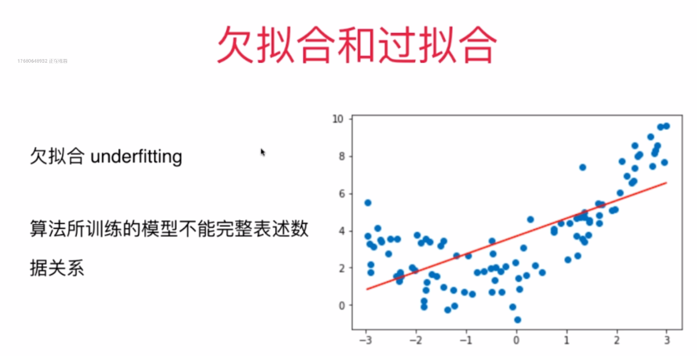
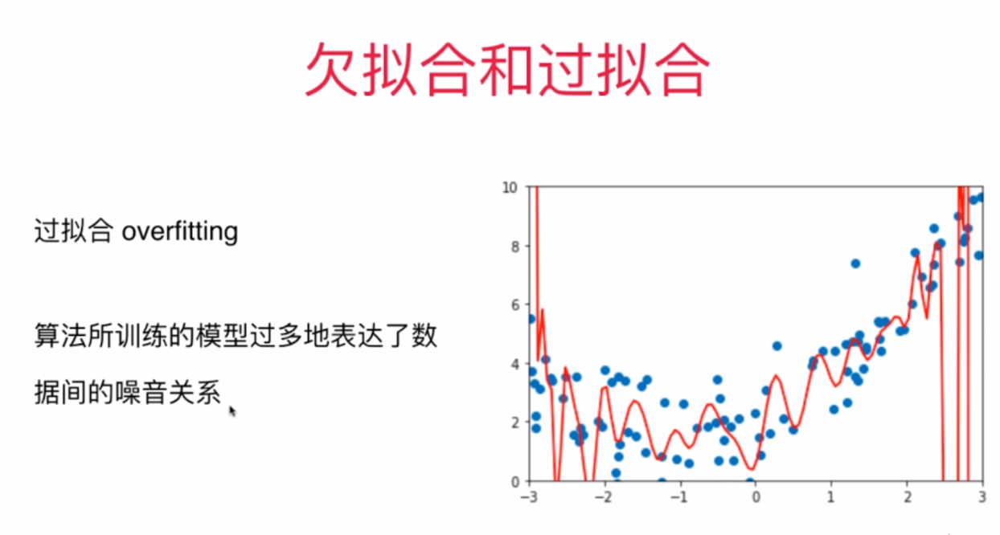
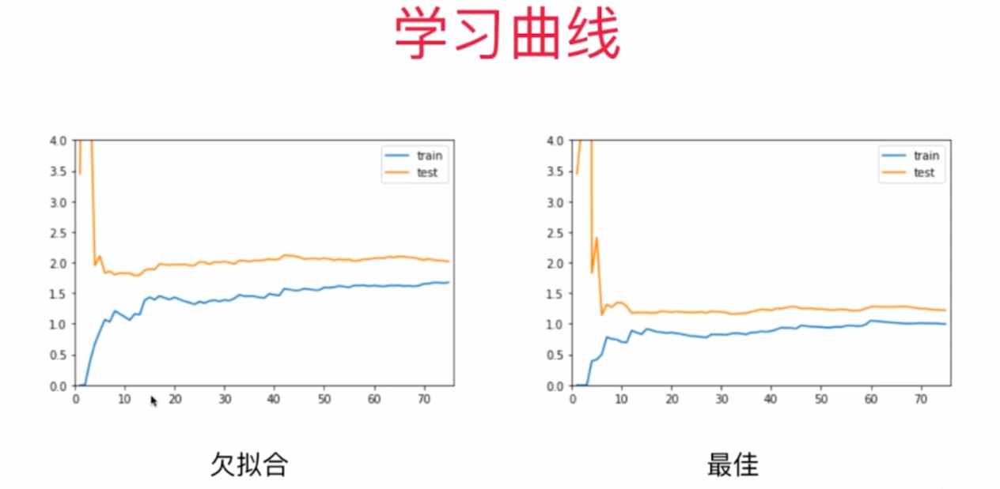
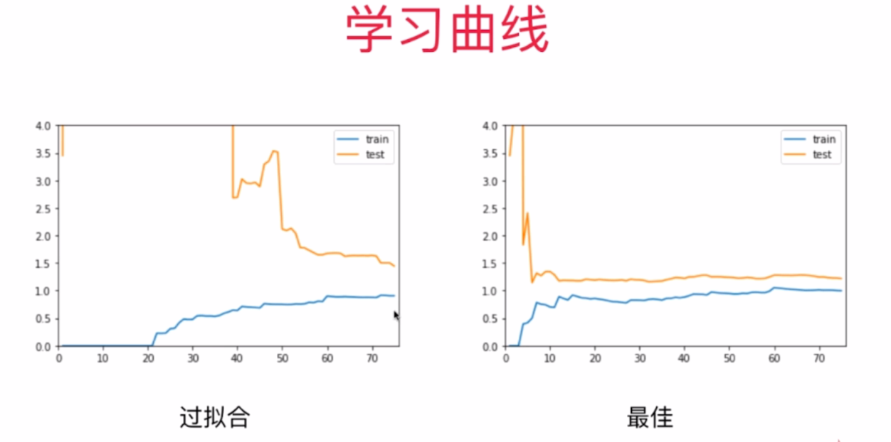
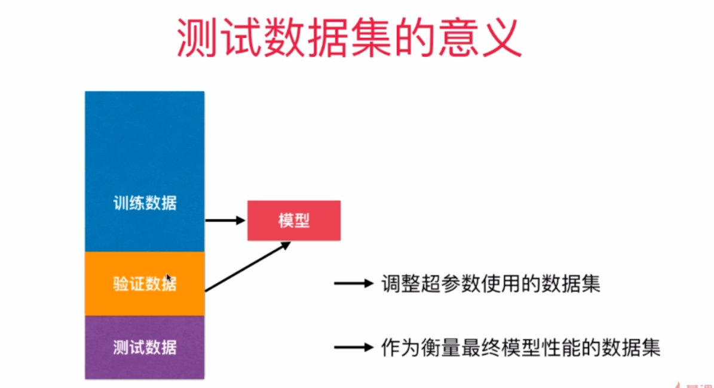
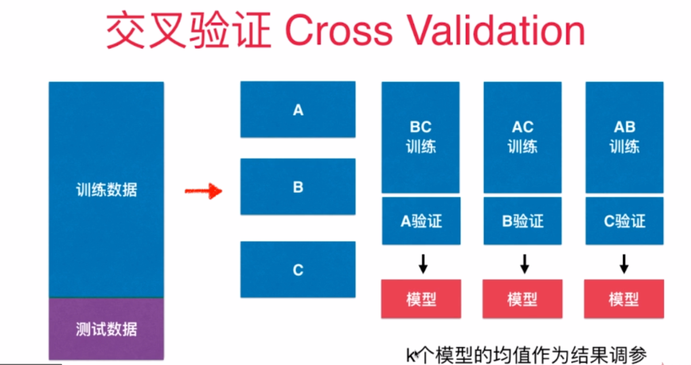
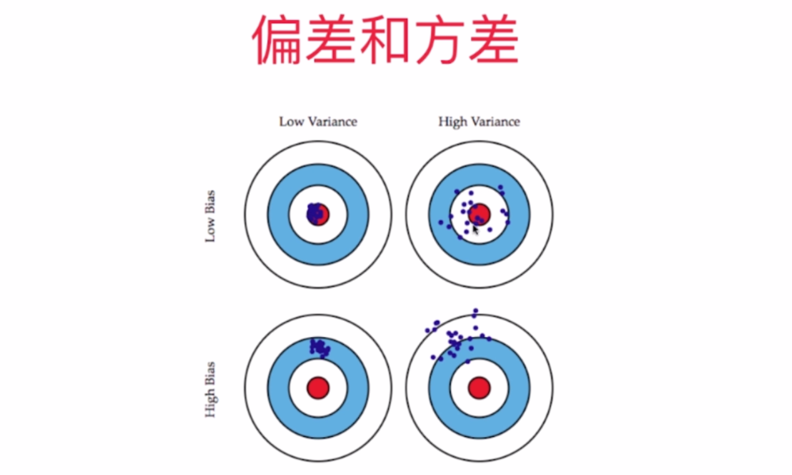
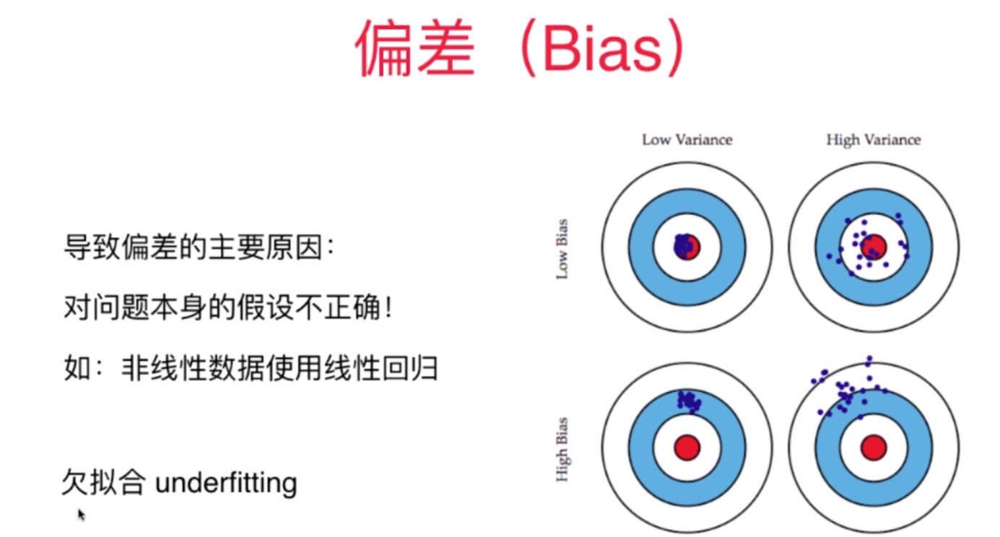
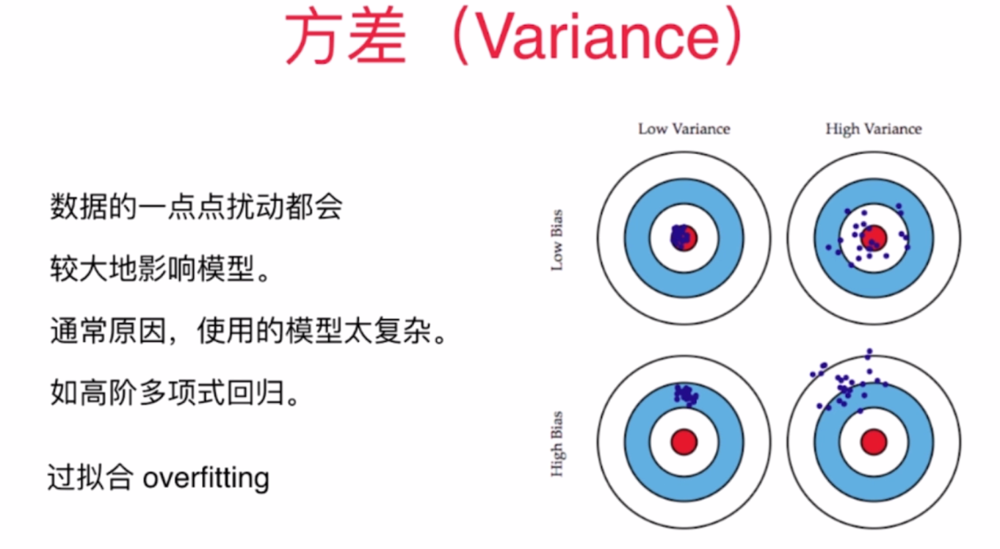

### 多项式回归:对非线性的数据进行拟合 , 不过,拟合过程也有陷阱的
如果原始数据是使用二次方程生成的,
### 欠拟合 underfitting:
- 那么使用一次方程得到的拟合结果,显然是欠拟合的.
- 算法所训练的模型不能完整表达数据关系

### 过拟合
- 算法所训练的模型过多地表达数据间的 '噪音' 关系, 但噪音数据,并不是我们想要的

- 如果是使用高于二次方程得到的拟合结果, 尤其是degree=10,100 ,甚至更高的degree进行拟合的话,结果一定是过拟合

### 学习曲线
随着训练样本的增多,算法训练出的模型的表现能力  

### Validation 和Cross Validation( 验证数据集与交叉验证)
- 留一法: 把训练数据集分成m份,称为留一法 Leave-one-out cross validation
  完全不受随机的影响,最接近模型真正的性能指标
  缺点:计算量大

- 
- 
### 偏差和方差, 以靶子为例
- 
- 
- 
- 模型误差 = 偏差(Bias) + 方差(Variance) + 不可避免的误差
- 机器学习的主要挑战,来自于方差
- 解决高方差的通常手段:
- 1,降低模型的复杂度
- 2,减少数据维度, 降噪
- 3,增加样本数(特别是深度学习方向)
- 4,使用验证集
- 5,模型正则化(重点)

### 模型正则化: 限制参数的大小
- 岭回归, 提高模型的泛化能力