# 分类准确度的问题
对于极度偏斜(Skewed Data)的数据, 只使用分类准确度是远远不够的
极度偏斜: 是指用于分类的数据有的很多,  有点很少. 例如癌症患者的数据,发病率0.01%, 健康人数99.99%
 必须引用其他的算法指标: 精准率和召回率, F1 Score
 - 准确度不能很好的表达模型的效果
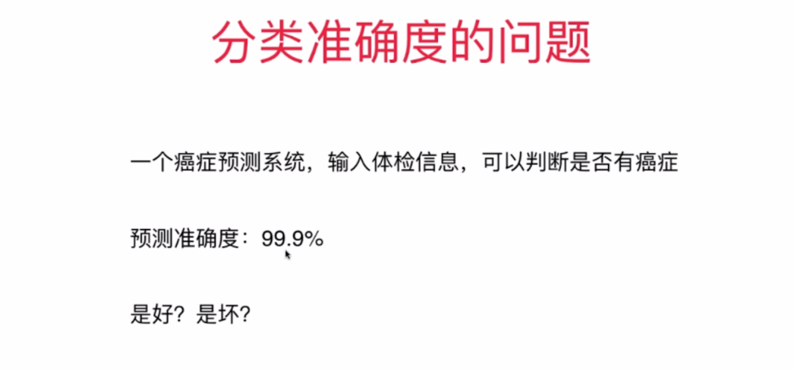
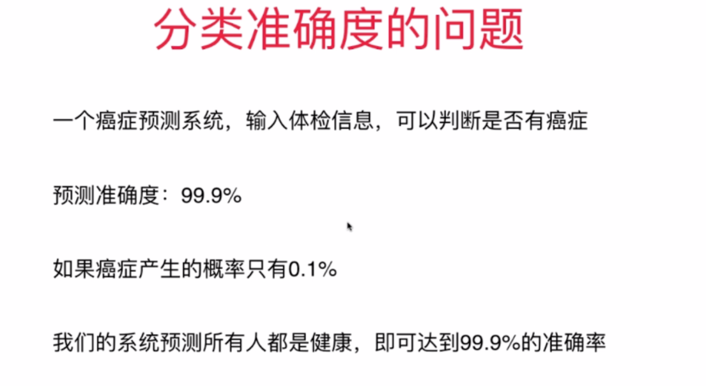
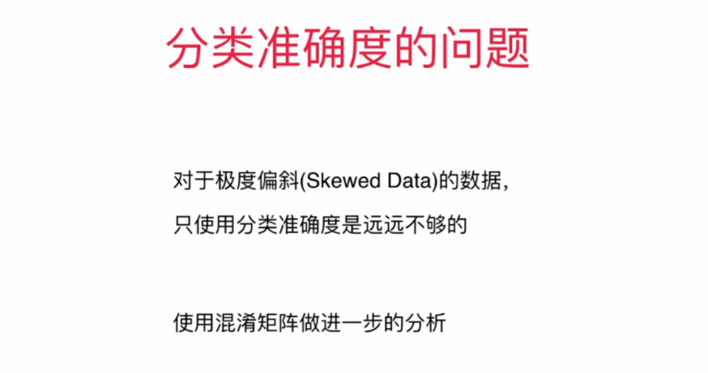
# 混淆矩阵
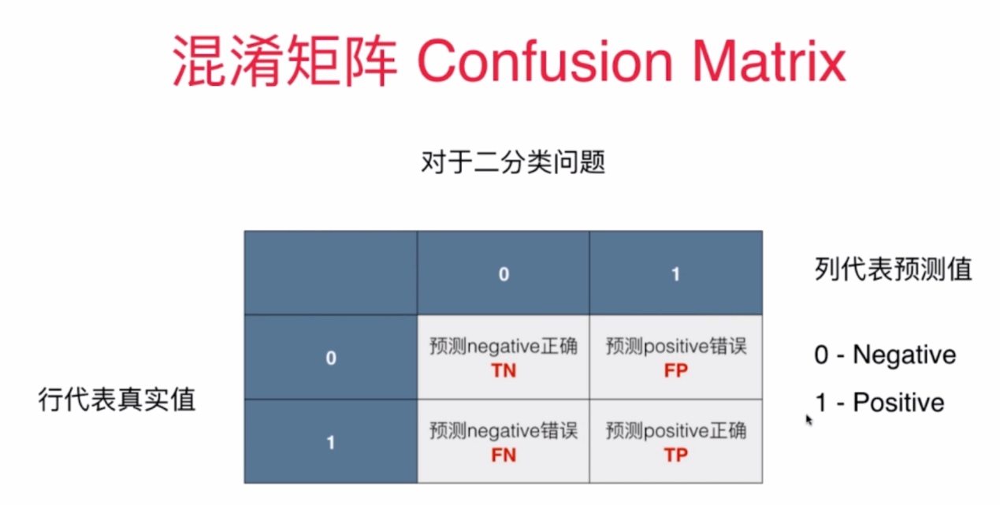

# 精准率和召回率
- 精准率 :在预测数据为1的集合,那么预测正确的概率是多少
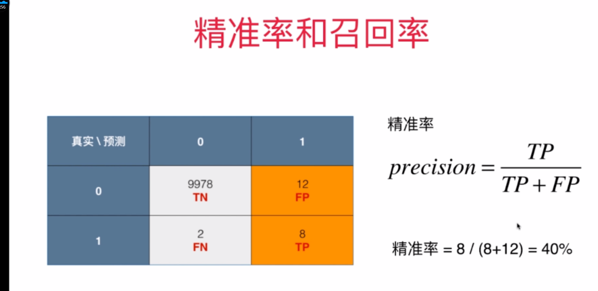
- 召回率: 在真实数据中, 预测正确的概率是多少
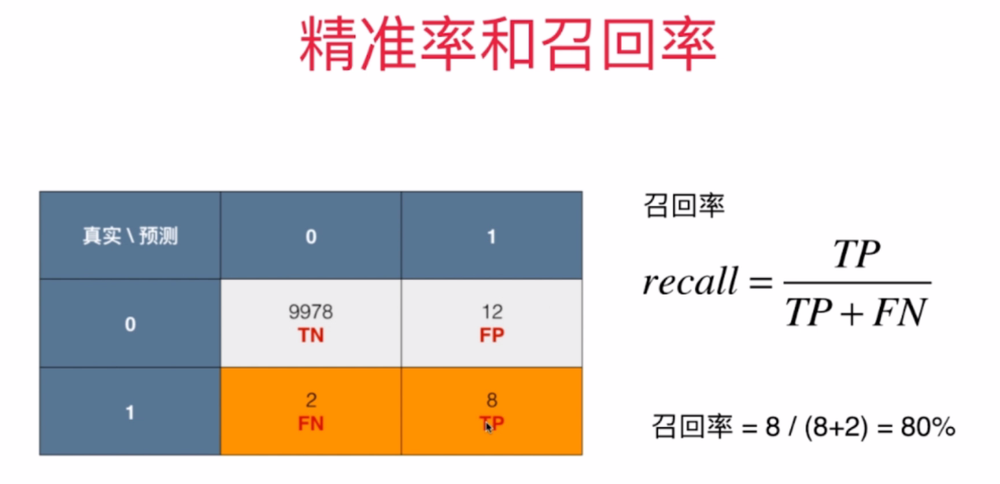

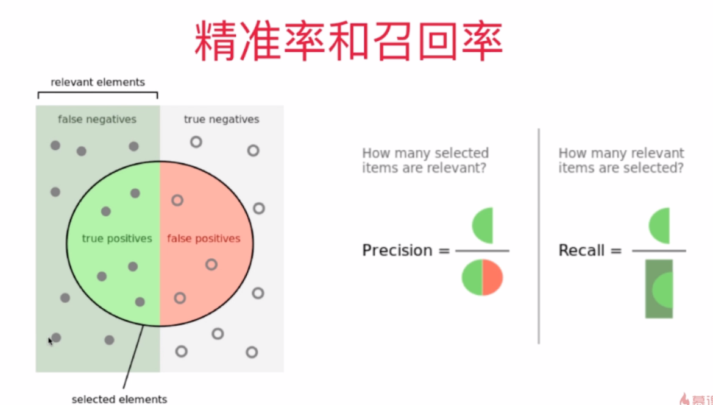

# 无意义的预测模型
- 因为精准率和召回率为0或无意义
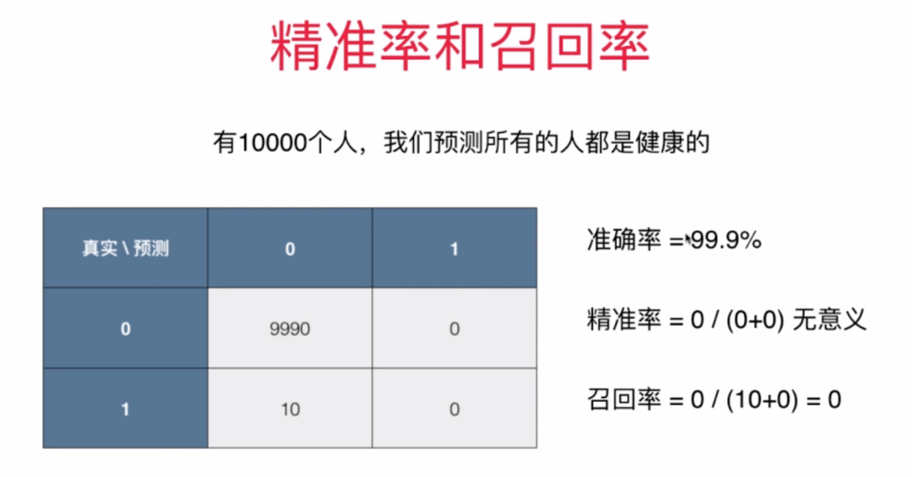

# F1 score:二者(精准率,召回率)都兼顾,是两者的调和平均值 ,取值范围: [0,  1]
- 1,有的时候我们注重精准率(预测正确的),如股票预测 (已购买的股票)
- 2,有的时候我们注重召回率.如病人诊断(应该预测正确所有的病人)
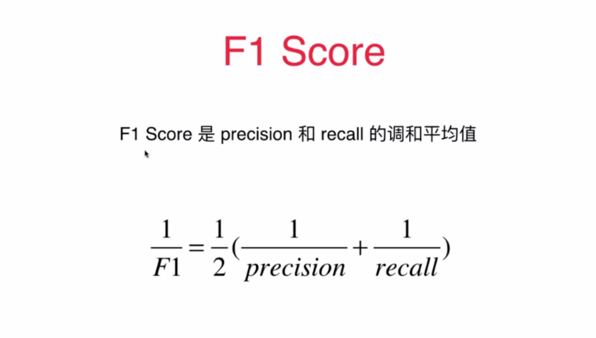
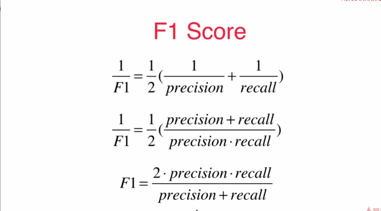

# 精准率,召回率的平衡, 阈值的改变,导致不同的值
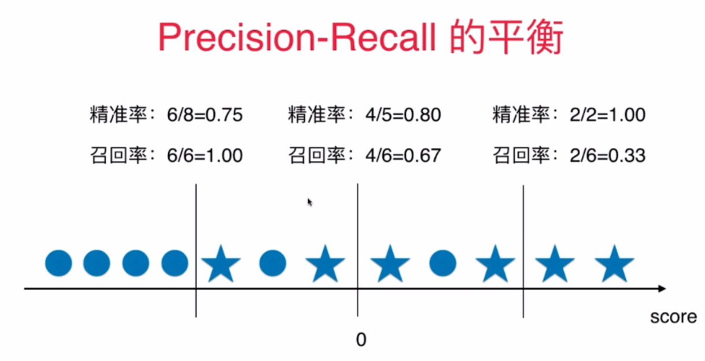

# ROC曲线

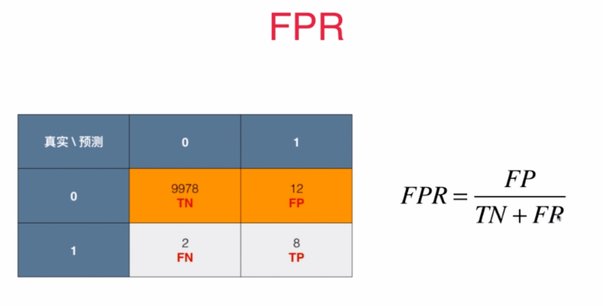

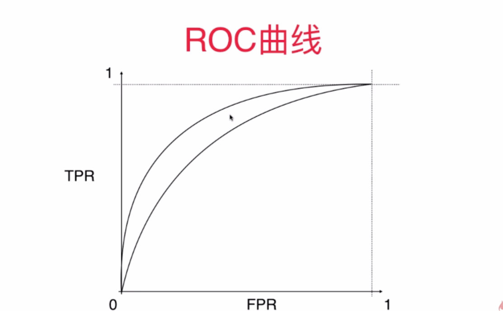
