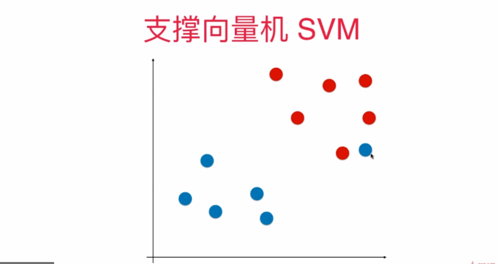

# 支撑向量机SVM
- SVM要最大化margin, 也就是最大化d

## Hard Margin SVM :解决的是线性可分问题

# SVM的几何意义

# 最后的公式是求最优化问题

## Soft Margin SVM :解决线性不可分问题, 其实是在Hard Margin SVM上的改进
- 线性不可分问题, 图示:

# 核函数
- 对于多项式核函数而言，它的核心思想是将样本数据进行升维，从而使得原本线性不可分的数据线性可分。
- 那么高斯核函数的核心思想是将每一个样本点映射到一个无穷维的特征空间，从而使得原本线性不可分的数据线性可分。

### 相关资料:
- 核函数（Kernel Function）https://www.cnblogs.com/volcao/p/9465214.html