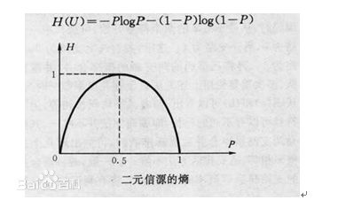

# 信息熵:

- 信息是个很抽象的概念。人们常常说信息很多，或者信息较少，但却很难说清楚信息到底有多少。比如一本五十万字的中文书到底有多少信息量。
- 直到1948年，香农提出了“信息熵”的概念，才解决了对信息的量化度量问题。信息熵这个词是C．E．香农从热力学中借用过来的。热力学中的热熵是表示分子状态混乱程度的物理量。香农用信息熵的概念来描述信源的不确定度。
- 信息论之父克劳德·艾尔伍德·香农第一次用数学语言阐明了概率与信息冗余度的关系。

- 
# 资料:
-  https://baike.baidu.com/item/%E4%BF%A1%E6%81%AF%E7%86%B5