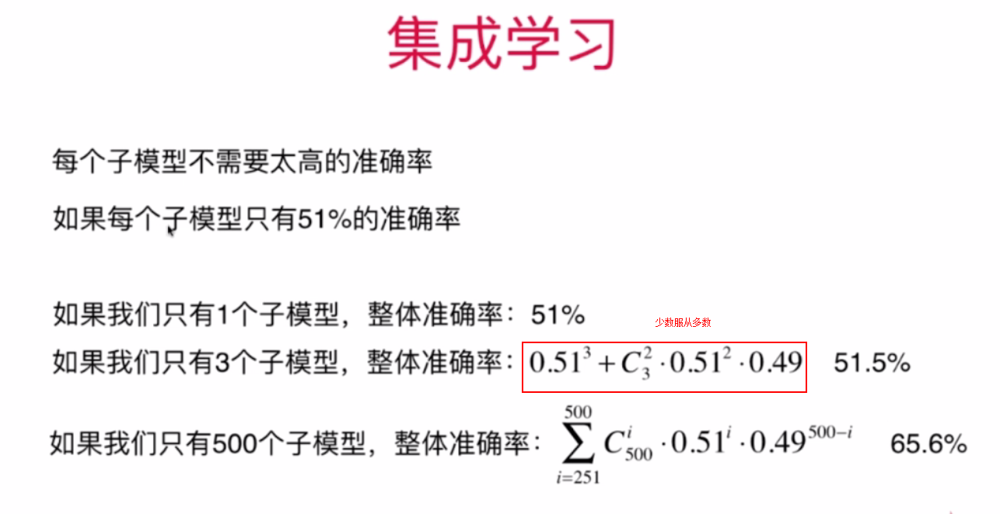
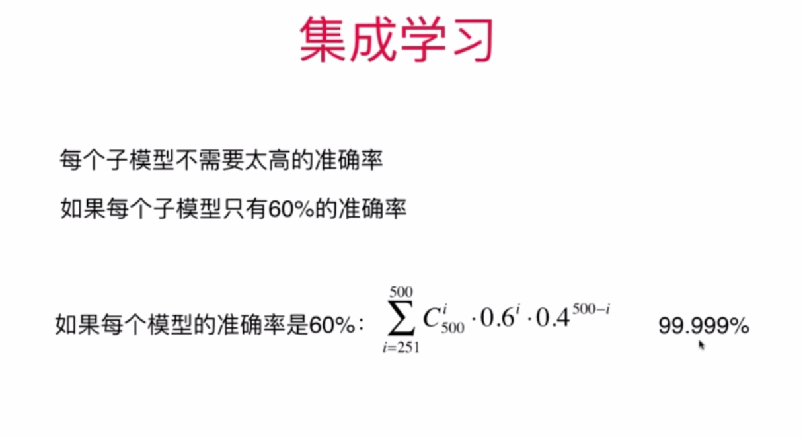
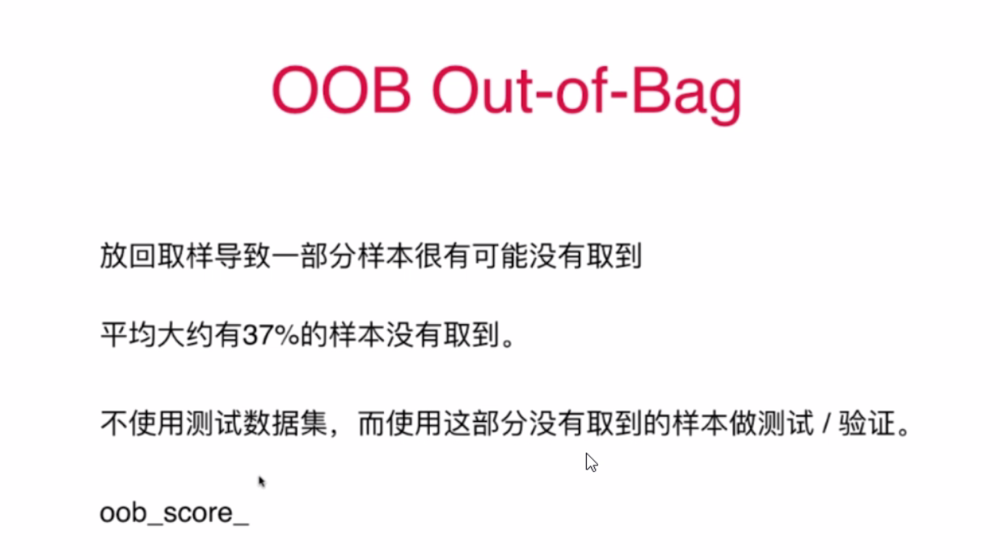
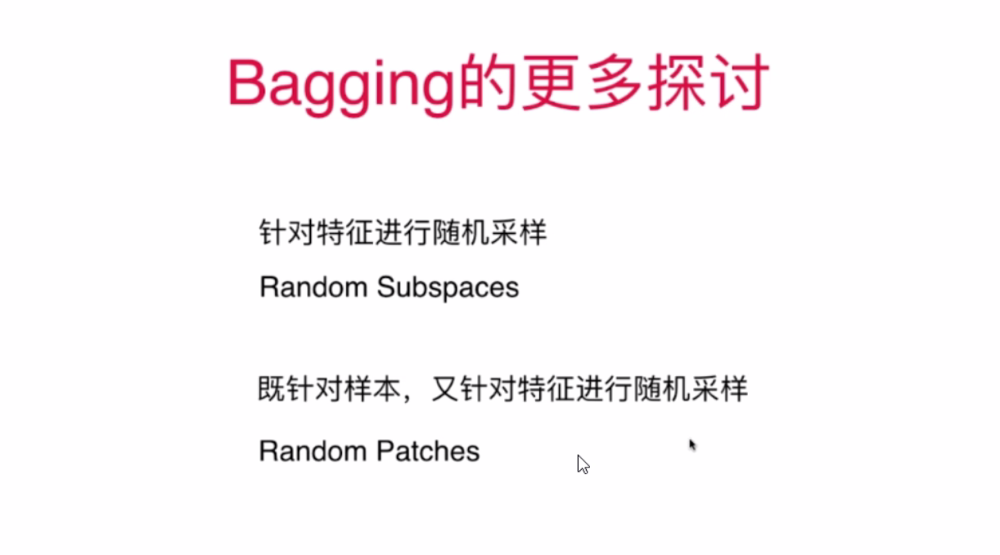
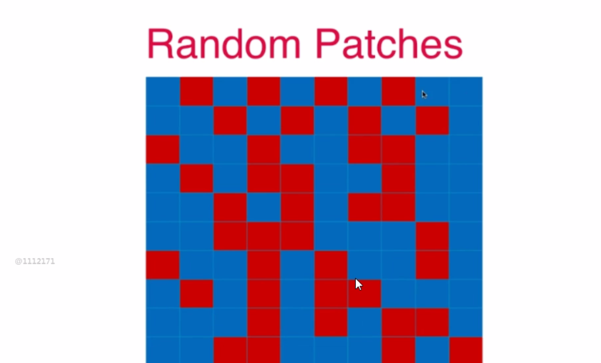
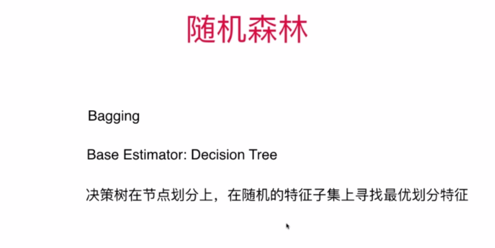
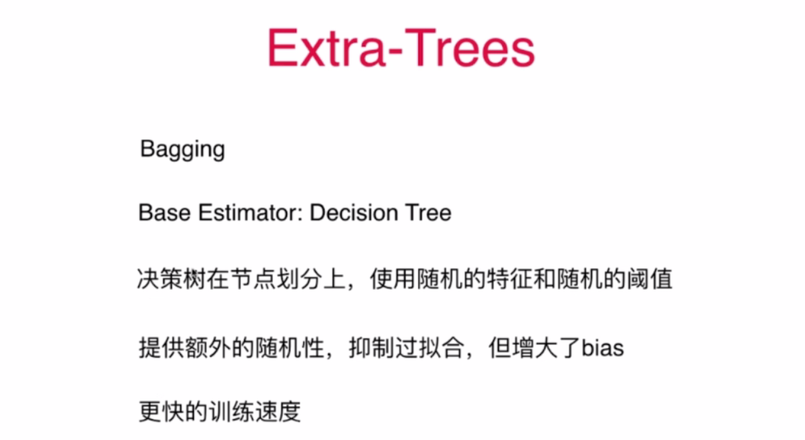
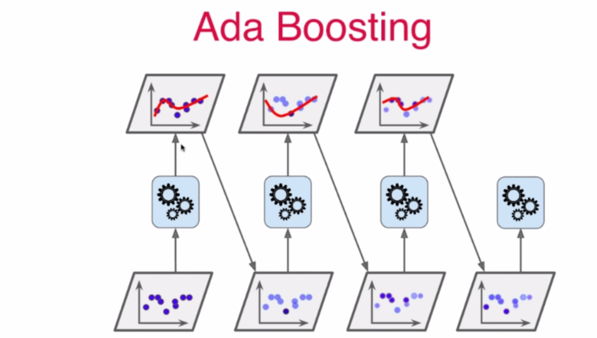
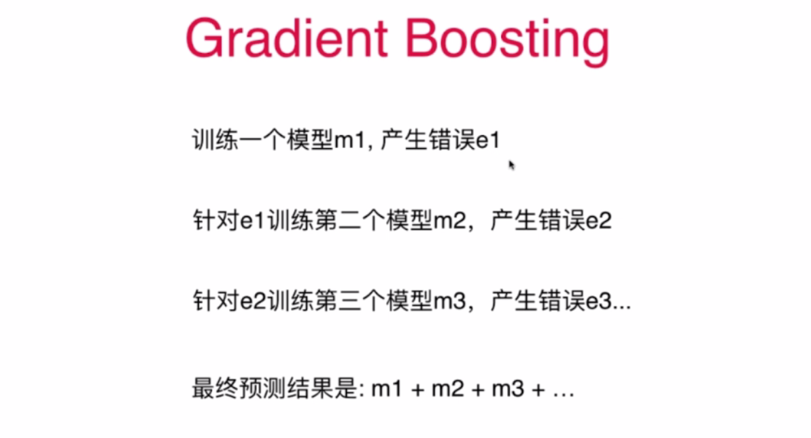

# 什么是集成学习
- 3: 如何创建差异性?
  每个子模型只看样本数据的一部分
  例如: 一共有500个样本数据,每个子模型只看100个样本数据.
  每个子模型不需要太高的准确率
  
  
## 取样: Bagging 和 Pasting
- Bagging: 放回取样,在统计学中,是 bootstrap . 
- Pasting: 不放回取样
- Bagging 在实际工程里更常用, 极易并行化处理

## OOB (out of bag)
- 
- 
- 

## 随机森林
- 

## Extra-Trees
- 

## Ada Boosting
- 

## Gradient Boosting
- 

- Hard Voting Classifier：根据少数服从多数来定最终结果；
- Soft Voting Classifier：将所有模型预测样本为某一类别的概率的平均值作为标准，概率最高的对应的类型为最终的预测结果；
- 课程笔记: https://www.cnblogs.com/volcao/p/9483026.html
- Bagging与随机森林算法原理: https://www.cnblogs.com/pinard/p/6156009.html
- 集成学习之Adaboost算法原理小结: https://www.cnblogs.com/pinard/p/6133937.html
- https://zhuanlan.zhihu.com/p/27689464